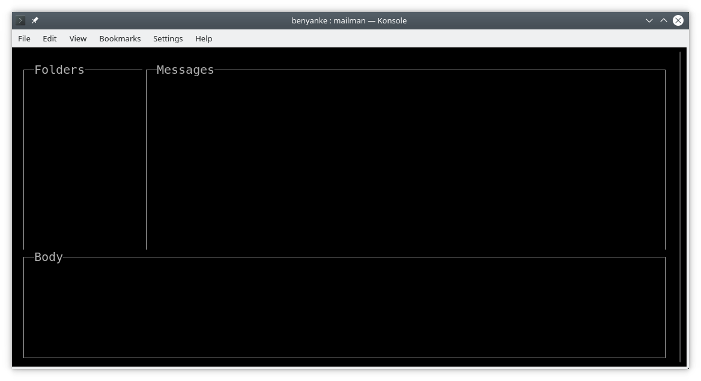

# Mailman
## Terminal Mail for Non-Neckbeards 

This is very early along. Nothing here yet, just a proof of concept. Built as a standard 
go package, using `dep` for dependencies. Vendored dependencies are committed to the repo,
so dep is not needed on your system unless you want to add or change packages.

## Run

To run, simply clone the project and build:

```
$ git clone https://github.com/benyanke/mailman.git
$ cd mailman
$ go build && ./mailman
```

## Config

tbd.

**Configuration Overrides**

  * Configuration directory is in ~/.mailman
    * Override with `--configdir`


## Current State
Working/done:
 * imap proof of concept (run `notmain` method and ensure you've set env vars `imap_host`, `imap_user`, and `imap_pass`
 * absolute basic 3 pane layout
 
 

## Future

Use this imap library: https://github.com/emersion/go-imap
